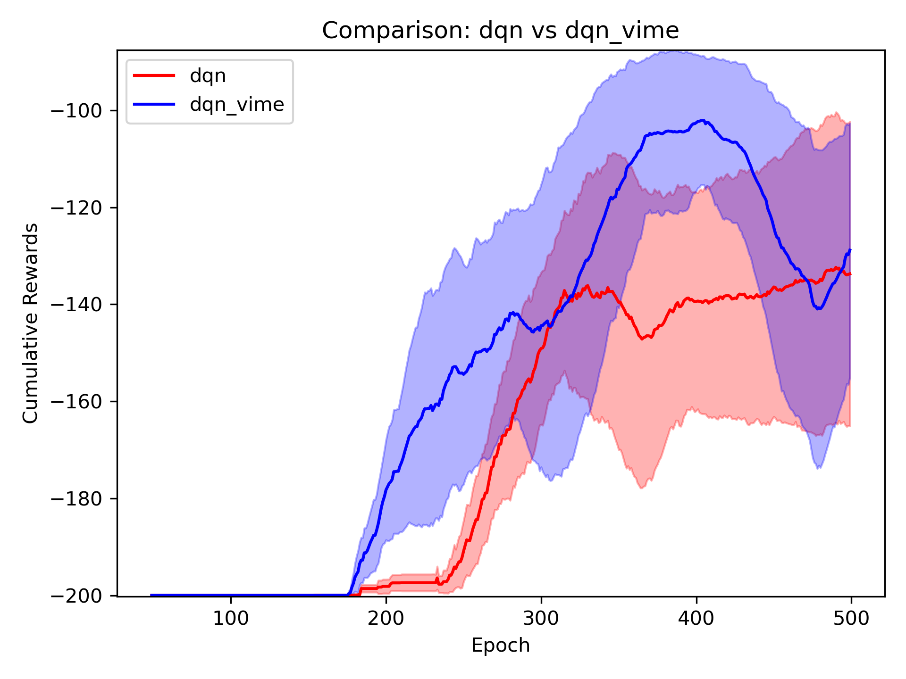
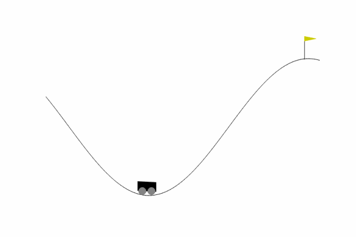
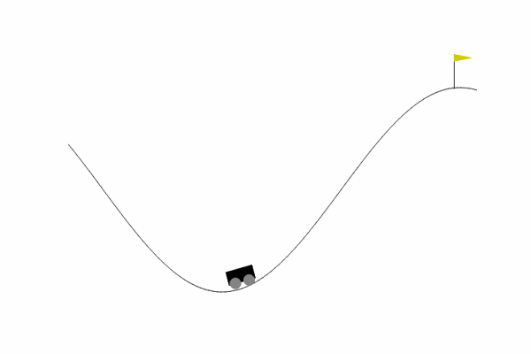

# VIME - Variational Information Maximizing Exploration

## Overview

This repository contains a minimal implementation of **Variational Information Maximizing Exploration (VIME)** to improve exploration in reinforcement learning environments with sparse rewards. The primary goal of VIME is to encourage agents to explore unknown areas in the environment by providing intrinsic rewards based on **information gain**.

### Why VIME?

In reinforcement learning, agents typically rely on rewards to determine valuable actions. However, in sparse reward environments, rewards are limited or delayed, making it challenging for agents to learn efficiently. VIME addresses this by giving agents intrinsic motivation to explore, even without immediate external rewards, using the following key steps:
- **Dynamics Model**: Models environment dynamics to estimate probabilities of state transitions.
- **Posterior Updates**: Updates the model's beliefs based on each new experience.
- **Intrinsic Reward Calculation**: Computes an intrinsic reward based on information gain.
- **Total Reward**: Combines extrinsic and intrinsic rewards to balance exploration and exploitation.


## Notebook Content

The notebook tries to augement the DQN we implemented in HW1 with VIME in environments with sparse rewards. We train the agents w/wo VIME and visualize their performance.

## Setup

```bash
conda env create --name vime --file=requirements.yaml
conda activate vime
```

## Results
The loss curves for DQN w/wo VIME are as followed:


From the demo gifs we could see DQN augmented with VIME was able to reach the mountain peak while the one without VIME failed.
<div style="text-align: center;">
  
  <p><em>DQN Policy</em></p>
</div>

<div style="text-align: center;">
  
  <p><em>DQN with VIME Policy</em></p>
</div>